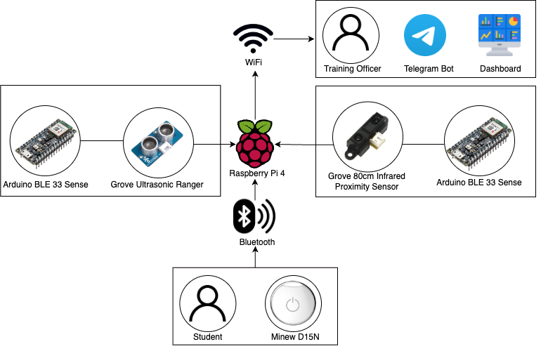

# BussinFlusshin

## Project Problem Statement

The training officers at MINDs teaches a group of 8 students and face frequent disruption to their teaching schedule when supporting students' toileting needs.

## Project Solution

- Alert TOs about students' whereabouts and track hygiene habits
- Ensure students toileting journey is smooth and alert TOs when students required help

## Solution Architecture



## Hardware

- Arduino Nano 33 BLE Sense
- Grove Ultrasonic Ranger
- Grove 80cm Infrared Proximity Sensor
- Mimew D15N
- Raspberry PI 4

## Software

- Next.js [Web Application]
- XState [State Management]
- MQTT [Messaging Broker]
- AWS Lambda [Telegram Bot]
- AWS API Gateway [Telegram Bot]

## Project Setup

### Dependencies

You will need the following dependencies:

- Docker
- Git

### Installation

Clone the project with the following command:
```sh
# clone the project and its submodules
git clone <repo-url> --recursive

# start the mqtt server
docker compose up
```

## Contributors

- Tan Soon Ann
- Franky
- Rayner Tan
- Brandon Hong
- Jared Choy
- Guo ZheTao
